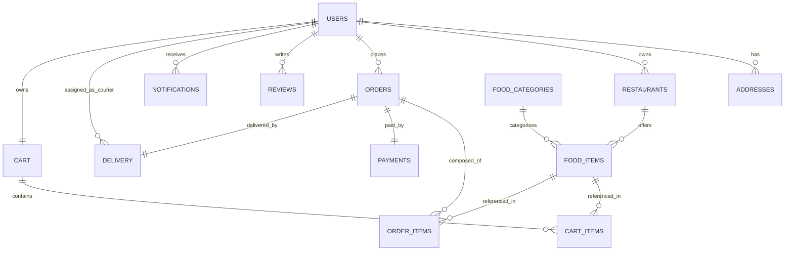

# 🍔 FoodExpress - Online Food Delivery Platform

[](https://adoptium.net/)
[](https://spring.io/projects/spring-boot)
[](https://www.mysql.com/)
[](https://www.docker.com/)
[](https://www.jenkins.io/)
[](https://opensource.org/licenses/Apache-2.0)

**FoodExpress** is a complete, enterprise-grade, full-stack online food delivery system engineered for real-world academic and industry demonstration. It simulates the end-to-end operational lifecycle of platforms like Swiggy, Zomato, and UberEats—from multi-criteria restaurant search and cart checkout to kitchen order dispatch, real-time courier tracking, safe mock payments, and comprehensive administrator analytics.

---

## 📌 Table of Contents
1. [Key Features](#-key-features)
2. [Technology Stack](#-technology-stack)
3. [Architecture Overview](#-architecture-overview)
4. [Folder Structure](#-folder-structure)
5. [Database Schema & ER Model](#-database-schema--er-model)
6. [Demo Accounts & Credentials](#-demo-accounts--credentials)
7. [Installation & Setup](#-installation--setup)
8. [Running with Docker Compose](#-running-with-docker-compose)
9. [Jenkins CI/CD Pipeline](#-jenkins-cicd-pipeline)
10. [REST API Documentation (Swagger / OpenAPI)](#-rest-api-documentation-swagger--openapi)
11. [Testing & Quality Assurance](#-testing--quality-assurance)
12. [Future Enhancements](#-future-enhancements)

---

## 🚀 Key Features

### 1. 👤 Authentication & Security
- **Stateless JWT (JSON Web Tokens)** authentication via JJWT 0.12.
- **BCrypt Password Hashing** (passwords are never stored in plain text).
- **Role-Based Access Control (RBAC)** across 4 user personas:
  - `CUSTOMER`
  - `RESTAURANT_ADMIN`
  - `DELIVERY_PARTNER`
  - `SYSTEM_ADMIN`
- Password change, forgot password, profile management.

### 2. 🍽️ Customer Module
- Multi-criteria search for restaurants and dishes by keyword, cuisine category, rating, and veg/non-veg flag.
- Detailed restaurant menus with dynamic pricing and item availability checks.
- Shopping cart with subtotal calculation, delivery fee, 5% GST tax, and promotional coupon discounts.
- Seamless checkout with saved addresses and safe mock payments.
- Live interactive order progress stepper (`PLACED` ➔ `ACCEPTED` ➔ `PREPARING` ➔ `READY_FOR_PICKUP` ➔ `OUT_FOR_DELIVERY` ➔ `DELIVERED`).
- Ratings and reviews (restricted strictly to completed orders).

### 3. 🏪 Restaurant Partner Module
- Restaurant management dashboard.
- Live order pipeline: accept/reject incoming orders, update preparation stage, mark ready for courier pickup.
- Menu management: add dishes, update prices, toggle availability in real-time.

### 4. 🛵 Delivery Courier Module
- Courier dispatch portal: view assigned deliveries with pickup addresses and customer contact.
- One-click status transitions: `Picked Up` ➔ `Out For Delivery` ➔ `Delivered & Collect Cash`.

### 5. 🛠️ System Administrator Module
- Platform analytics: total customers, restaurants, couriers, gross platform revenue, and active orders.
- User management: activate or disable user accounts.
- Restaurant management: approve new restaurants or disable non-compliant partners.
- Coupon engine: create percentage or fixed discount coupons with minimum order values, caps, and expiry dates.

### 6. 💳 Safe Mock Payment Gateway
- Supports **Cash on Delivery (COD)**, **Mock Cards**, **Mock UPI**, and **Mock Wallet**.
- Generates unique transaction IDs and payment audit receipts with automatic refund handling on cancellations.

---

## 💻 Technology Stack

| Layer | Technologies |
|:---|:---|
| **Backend Framework** | Java 21, Spring Boot 3.3.2, Spring MVC, Spring Security 6 |
| **Persistence / ORM** | Spring Data JPA, Hibernate, MySQL Connector/J 8 |
| **Authentication** | JSON Web Tokens (JJWT 0.12.5), BCrypt Password Encoder |
| **API Documentation** | OpenAPI 3.0 / Swagger UI (springdoc-openapi 2.6.0) |
| **Database** | MySQL 8.0 (Production / Docker), H2 In-Memory (Test Suite) |
| **Frontend** | HTML5, CSS3, JavaScript (ES6+), Bootstrap 5.3, FontAwesome 6 |
| **Build & DevOps** | Maven 3.9.6, Docker, Docker Compose, Jenkins Pipeline, Git |
| **Testing** | JUnit 5, Mockito, Spring Boot Test |

---

## 🏛️ Architecture Overview

FoodExpress follows a layered, decoupled enterprise architecture:

```text
[ Browser / Single-Port Client (HTML5 / Bootstrap 5 / JS) ]
                           │
                           │  HTTP / REST (JSON) + Bearer JWT
                           ▼
[ Spring Security Filter Chain (JwtAuthenticationFilter) ]
                           │
                           ▼
[ Controller Layer (@RestController, @RequestMapping) ]
                           │  (Validates DTOs with Jakarta Validation)
                           ▼
[ Service Layer (@Service, @Transactional) ]
   ├── UserService          ├── RestaurantService     ├── OrderService
   ├── CartService         ├── PaymentService        ├── DeliveryService
   └── CouponService       └── ReviewService         └── NotificationService
                           │
                           ▼
[ Repository Layer (Spring Data JPA) ]
                           │  (Hibernate Object-Relational Mapping)
                           ▼
[ Relational Database (MySQL 8 / H2 Test) ]
```

---

## 📂 Folder Structure

```text
FoodExpress/
│
├── pom.xml                                  # Root aggregator Maven project
├── Dockerfile                               # Multi-stage production build container
├── docker-compose.yml                       # MySQL 8 + FoodExpress full-stack compose
├── Jenkinsfile                              # 7-stage Declarative CI/CD pipeline
├── .gitignore                               # Git ignore configuration
├── README.md                                # Comprehensive documentation
│
├── backend/
│   ├── pom.xml                              # Backend dependencies (Spring Boot, JJWT, MySQL)
│   └── src/
│       ├── main/
│       │   ├── java/com/foodexpress/
│       │   │   ├── config/                  # OpenApiConfig, WebMvcConfig, DataInitializer
│       │   │   ├── controller/              # REST Controllers (Auth, Customer, Order, etc.)
│       │   │   ├── dto/                     # Request/Response Data Transfer Objects
│       │   │   ├── entity/                  # JPA Entities (User, Order, FoodItem, etc.)
│       │   │   ├── exception/               # Custom exceptions & GlobalExceptionHandler
│       │   │   ├── repository/              # Spring Data JPA interfaces
│       │   │   ├── security/                # JwtTokenProvider, SecurityConfig, Filters
│       │   │   ├── service/                 # Core business services
│       │   │   └── FoodExpressApplication.java
│       │   └── resources/
│       │       ├── application.properties   # App configurations & environment defaults
│       │       └── static/                  # Single-port UI bundle (served at port 8080)
│       └── test/
│           ├── java/com/foodexpress/service/ # JUnit 5 & Mockito test cases
│           └── resources/application-test.properties # H2 in-memory test configuration
│
├── frontend/                                # Standalone Frontend source
│   ├── index.html                           # Home / discovery page
│   ├── login.html                           # Login with 1-click demo buttons
│   ├── register.html                        # Registration page with role selection
│   ├── restaurants.html                     # Restaurant listing with multi-criteria search
│   ├── restaurant.html                      # Menu page, item cart addition & reviews
│   ├── cart.html                            # Interactive shopping cart & coupon validation
│   ├── checkout.html                        # Address selection & safe mock payment
│   ├── orders.html                          # Order history
│   ├── tracking.html                        # Live interactive step-by-step progress tracking
│   ├── profile.html                         # User profile and address management
│   ├── admin/dashboard.html                 # System administrator management portal
│   ├── restaurant/dashboard.html            # Restaurant kitchen order manager
│   ├── delivery/dashboard.html              # Delivery courier dispatch portal
│   ├── css/style.css                        # Theme stylesheets
│   └── js/api.js                            # Centralized API fetch wrapper with JWT
│
└── database/
    └── schema.sql                           # Production MySQL 8 relational DDL
```

---

## 🗄️ Database Schema & ER Model

The relational database is normalized into 15 tables with explicit foreign keys, indexes, and unique constraints:



---

## 🔑 Demo Accounts & Credentials

The application automatically seeds baseline demo accounts, restaurants, menus, and coupons upon initial startup:

| Role | Email Address | Password | Permissions |
|:---|:---|:---|:---|
| **System Admin** | `admin@foodexpress.com` | `Admin@123` | Platform-wide metrics, approve restaurants, toggle users, manage coupons |
| **Restaurant Admin** | `manager@spicytreats.com` | `Partner@123` | Kitchen orders, menu items, prices, item availability |
| **Delivery Courier** | `courier@foodexpress.com` | `Courier@123` | Assigned deliveries, pickup, transit, marked delivered |
| **Customer** | `customer@foodexpress.com` | `Customer@123` | Search, add to cart, apply coupons, checkout, track order, reviews |

> [!TIP]
> On the **Login Page** (`/login.html`), convenient **One-Click Demo Login** buttons are provided so you can switch roles instantly during evaluations without typing credentials!

---

## 🛠️ Installation & Setup

### Prerequisites
- **JDK 21** or higher
- **Maven 3.9+** (or use the included Maven wrapper)
- **MySQL 8.0** (or Docker)

### 1. Database Configuration
Create the database in MySQL:
```sql
CREATE DATABASE foodexpress_db CHARACTER SET utf8mb4 COLLATE utf8mb4_unicode_ci;
```

Alternatively, execute [`database/schema.sql`](file:///C:/Users/user/.gemini/antigravity/scratch/FoodExpress/database/schema.sql) directly.

### 2. Configure Environment Variables (Optional)
Defaults in `application.properties` connect to `localhost:3306` with username `root` and password `root123`. You can override these using environment variables:

```powershell
$env:DB_HOST="localhost"
$env:DB_PORT="3306"
$env:DB_NAME="foodexpress_db"
$env:DB_USER="root"
$env:DB_PASSWORD="your_mysql_password"
$env:JWT_SECRET="YourVeryLongAndSecureSecretKeyWithAtLeast256BitsLengthForJwt"
```

### 3. Run Backend & Frontend Locally
Run the Spring Boot application using Maven:

```powershell
# From FoodExpress project root:
mvn spring-boot:run -f backend/pom.xml
```

Once started, the entire application (Backend REST APIs + Frontend Web Application) is live at:
- **Application URL:** [http://localhost:8080](http://localhost:8080)
- **Interactive Swagger Documentation:** [http://localhost:8080/swagger-ui.html](http://localhost:8080/swagger-ui.html)
- **OpenAPI Schema:** [http://localhost:8080/api-docs](http://localhost:8080/api-docs)

---

## 🐳 Running with Docker Compose

Run the entire system (Spring Boot backend + MySQL database) with a single command:

```bash
docker compose up --build
```

To run in the background (detached mode):
```bash
docker compose up -d
```

To stop all containers and retain data volume:
```bash
docker compose down
```

---

## 🏗️ Jenkins CI/CD Pipeline

The project includes a ready-to-run Declarative [`Jenkinsfile`](file:///C:/Users/user/.gemini/antigravity/scratch/FoodExpress/Jenkinsfile) configured with 7 automated stages:

1. **Checkout:** Clones source code from Git repository.
2. **Build:** Compiles backend code using Java 21 & Maven.
3. **Unit & Integration Tests:** Runs JUnit 5 test suite and publishes XML test reports.
4. **Package:** Packages standalone executable JAR and archives build artifacts.
5. **Docker Build:** Builds Docker image with Git build number tagging.
6. **Docker Test:** Validates container startup and health.
7. **Docker Hub Publish (Optional):** Pushes production images to Docker Hub using secure Jenkins credentials (`dockerhub-credentials`).

---

## 📖 REST API Documentation (Swagger / OpenAPI)

Interactive Swagger UI is enabled out-of-the-box at:
👉 **[http://localhost:8080/swagger-ui.html](http://localhost:8080/swagger-ui.html)**

### Sample Endpoints Summary

| Method | Endpoint | Description | Access |
|:---|:---|:---|:---|
| `POST` | `/api/auth/register` | Register new user | Public |
| `POST` | `/api/auth/login` | Authenticate and obtain JWT | Public |
| `GET` | `/api/restaurants` | List active restaurants | Public |
| `GET` | `/api/restaurants/search` | Search by keyword, category, rating, sort | Public |
| `GET` | `/api/foods/restaurant/{id}` | Get restaurant menu items | Public |
| `GET` | `/api/cart` | Get current shopping cart | Customer |
| `POST` | `/api/cart/items` | Add item to cart | Customer |
| `POST` | `/api/cart/apply-coupon` | Apply promotional discount code | Customer |
| `POST` | `/api/orders` | Place order from cart | Customer |
| `GET` | `/api/orders/track/{number}` | Live track order progress | Authenticated |
| `PUT` | `/api/orders/{id}/cancel` | Cancel order (allowed before preparation) | Customer / Admin |
| `PUT` | `/api/orders/{id}/status` | Update kitchen preparation stage | Restaurant Admin |
| `PUT` | `/api/delivery-partner/orders/{id}/deliver` | Courier marks delivery complete | Delivery Partner |
| `GET` | `/api/admin/dashboard/stats` | Platform performance and revenue analytics | System Admin |

---

## 🧪 Testing & Quality Assurance

Unit and integration test suites are written using **JUnit 5** and **Mockito** with an in-memory **H2 database** (no MySQL dependency required during test execution).

Execute the test suite:
```powershell
mvn test -f backend/pom.xml
```

**Results:**
- `CartServiceTest`: 2 tests passed (item additions, quantity modifiers, tax/delivery math).
- `CouponServiceTest`: 4 tests passed (discounts, caps, minimum order validation, expiration).
- `OrderServiceTest`: 4 tests passed (state machine validation, legal transitions, cancellation rules).
- `PaymentServiceTest`: 2 tests passed (mock card and cash on delivery handling).
- `UserServiceTest`: 4 tests passed (registration, duplicate checks, password change).
- **Total: 16 Tests Passed, 0 Failures, 0 Errors.**

---

## 🔮 Future Enhancements
- Real-time WebSockets for instant courier location updates on OpenStreetMap/Google Maps.
- Live SMS/Email notifications via Twilio or SendGrid.
- Automated delivery partner geo-allocation algorithm based on proximity.
- Real-world Razorpay / Stripe payment gateway integration.
